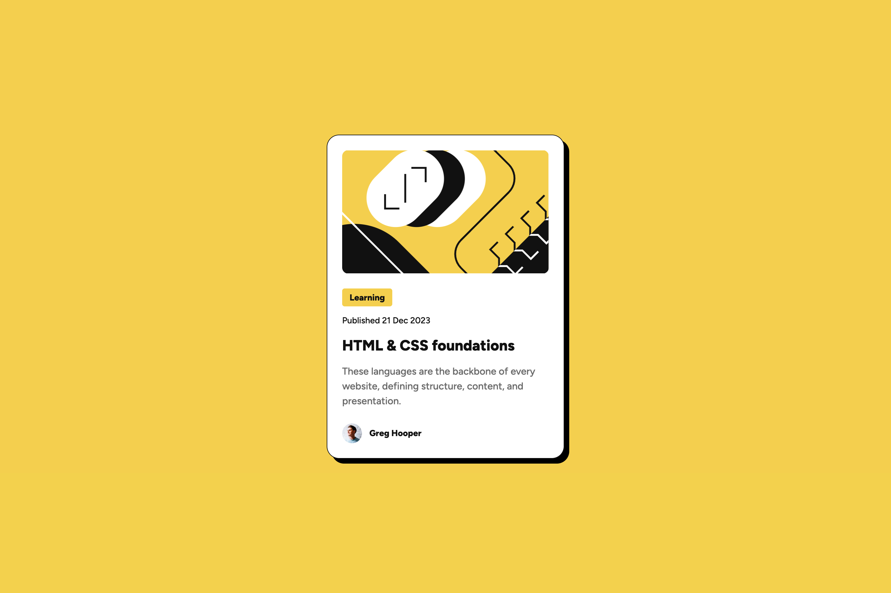

# Frontend Mentor - Blog preview card solution

This is a solution to the [Blog preview card challenge on Frontend Mentor](https://www.frontendmentor.io/challenges/blog-preview-card-ckPaj01IcS). Frontend Mentor challenges help you improve your coding skills by building realistic projects.

## Table of contents

- [Overview](#overview)
  - [The challenge](#the-challenge)
  - [Screenshot](#screenshot)
  - [Links](#links)
- [My process](#my-process)
  - [Built with](#built-with)
  - [What I learned](#what-i-learned)

## Overview

### The challenge

Users should be able to:

- See hover and focus states for all interactive elements on the page

### Screenshot

### Links

- Solution URL: [https://www.frontendmentor.io/solutions/blog-preview-card-challenge-1uElt2V3tH](https://www.frontendmentor.io/solutions/blog-preview-card-challenge-1uElt2V3tH)
- Live Site URL: [https://sascha-wagner99.github.io/frontend-mentor/blog-preview-card/](https://sascha-wagner99.github.io/frontend-mentor/blog-preview-card/)

## My process

### Built with

- Semantic HTML5 markup
- CSS custom properties
- Flexbox
- CSS Grid

### What I learned

During this challenge, I learned the following:

- **Whitespace gap**: I discovered that `img` tags are inline elements and can create invisible gaps due to whitespace in the HTML. This issue can be tricky to debug as the gaps are not visible in the developer tools. To fix this, I used CSS to set the `display` property of the `img` tags to `block`.

- **Flexbox default alignment**: I learned that the default value for `align-items` in Flexbox is `stretch`, which can cause child elements to stretch to the width of the container. To address this, I explicitly set `align-items: flex-start;` to ensure the elements aligned as intended.
